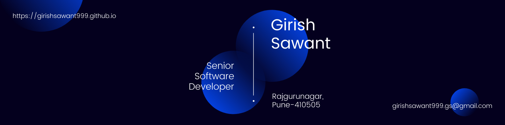

<!-- 

  

 -->

  

  A passionate full stack developer with a flair for creating elegant solutions
  in the least amount of time from India. Developed an e-commerce web app,
  customer web portal, documentary launch website, and donations websites for a
  local charity. Passionate about software architecture and new technologies.
  Regular attendee of web developer meetups. Always ready for learning new
  things.

 

  

## **<u>My Tech Stack</u>**
### Front End

 
 
 
 
 
 
 
 
 

 

### Back End

 
 
 
 
 

### Mobile

  

### Cloud

 
 
 
 
 

### CI & CD

 
 

 

### Agile & Version Control

 
 
 
 

 

## **<u>Connect With Me</u>**

 

## **<u>Github Trophies</u>**

 
  

---
